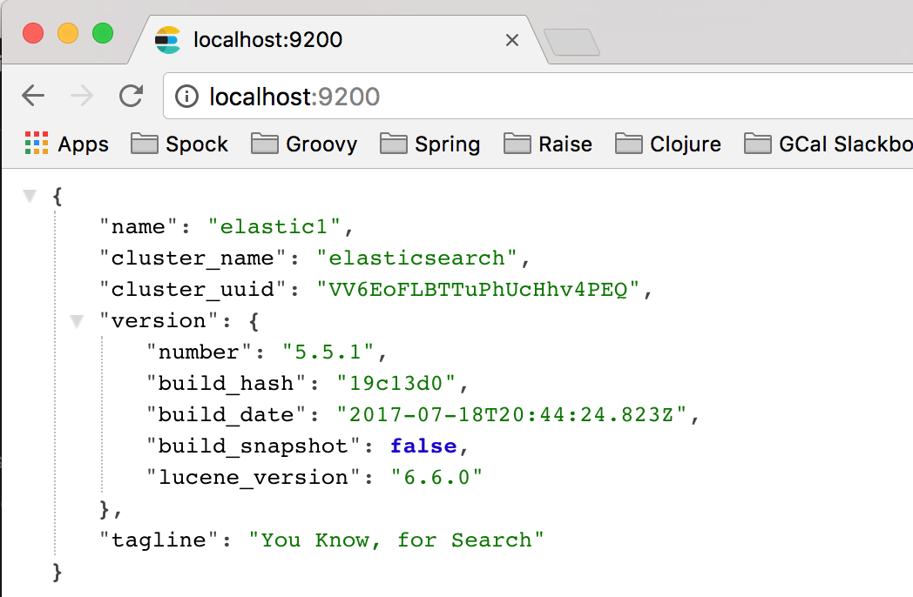
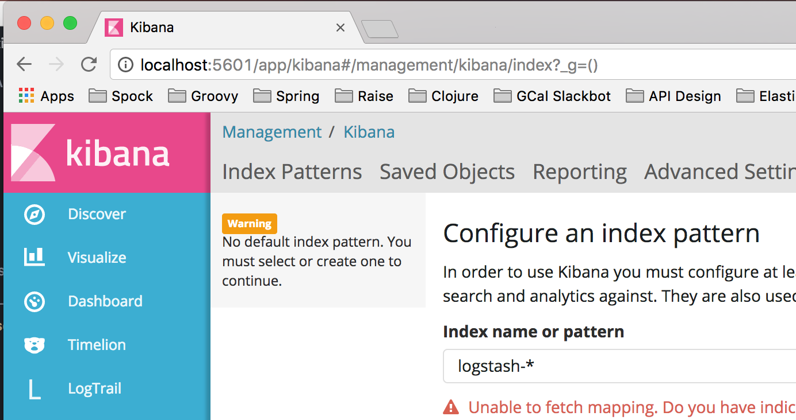
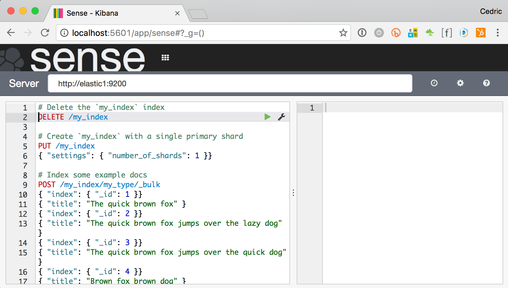
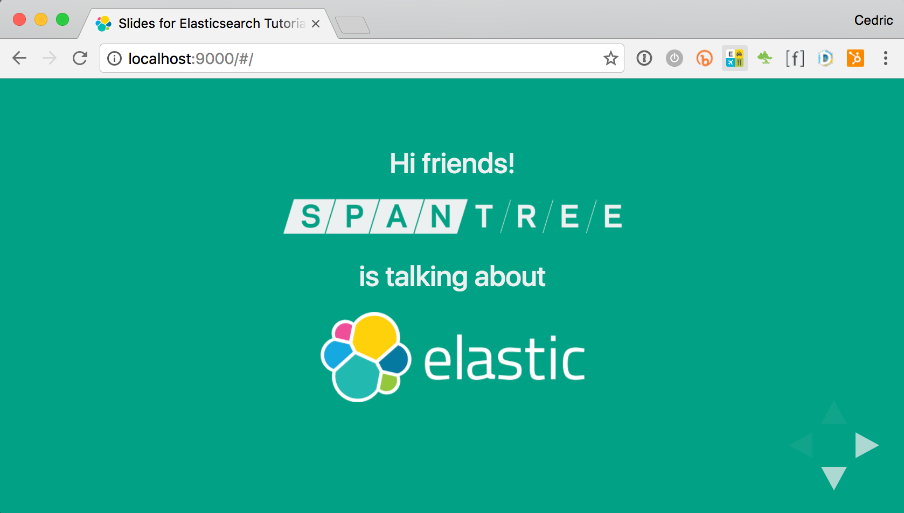

## Elasticsearch Talk

The following repository corresponds to [Spantree](http://www.spantree.net)'s Elasticsearch workshop. It uses Docker and Docker Compose to launch number of containers for exploration of Elasticsearch. It also contains all the slides in our deck, courtesy of [reveal.js](https://github.com/hakimel/reveal.js/).

### Screencast

If you're more of a visual and auditory learner, we've got you covered! We recorded a [live version](http://bit.ly/strangeloop-elasticsearch) of this talk during our [workshop at the StrangeLoop Conference](https://thestrangeloop.com/sessions/getting-started-with-elasticsearch) in September 2014, though most of the artifacts have since been updated for later versions of Elasticsearch.

### Authors

**Cedric Hurst:** Principal &amp; Lead Software Engineer<br/>
**Kevin Greene:** Senior Software Engineer<br/>
**Gary Turovsky:** Senior Software Engineer Emeritus<br/>
**Jonathan Freeman:** Senior Software Engineer<br/>

### Instructions for setting up this sample project

We ask that you walk through these steps before you stop by since you'll need to download stuff
and we don't want to crush the hotel bandwidth.  The project itself will likely evolve up until
the time of the presentation, but the Docker stuff shouldn't change too much.

#### Tools You'll Need

Install the following tools to bootstrap your environment. We've tested this setup primarily on Macs.

* Install [Git](https://help.github.com/articles/set-up-git).
* Install [Docker (Native Linux)](https://docs.docker.com/engine/installation/) or [Docker for Mac](https://docs.docker.com/docker-for-mac/).

Note: If you're running Docker for Mac, be sure to assign about 4-6GB to your
Docker engine by clicking on the whale in the Mac status bar, selecting
"Preferences" and then going to the "Advanced" tab. The more memory, the better.

#### Clone this repository and start Docker Compose

```bash
git clone --depth 1 https://github.com/Spantree/elasticsearch-talk.git
cd elasticsearch-talk
./init-all-the-things.sh
```

Note: Our reveal.js-based slide deck downloads a good chunk of the internet to fulfill its NPM dependencies. Unfortunately, downloads can sometimes get stuck. If you find yourself staring a screen for over 10 minutes with a message `Waiting for port 9000 to be open`, cancel out of the process by hitting `Ctrl-C` and try `./init-all-the-things.sh` again. You can also open another Terminal tab to the same folder and run `docker-compose logs -f` to see what's going on with the containers running in the background of this script.

#### Dance!

That's it. That's all there is to it.

You should now be able to access a multitude of services on your machine from a web browser:

[Elasticsearch](http://localhost:9200)

The HTTP interface for interacting with Elasticsearch



[Kibana](http://localhost:5601)

The dashboard and UI portal for Elasticsearch



[Sense](http://localhost:5601/app/sense)

A web-based IDE for messing with Elasticsearch queries.



[Inquisitor](http://localhost:9400)

A interactive debugging tool that shows how analyzers and tokenizers workshop


[Kopf](http://localhost:9200/_plugin/kopf)

A status and realtime control panel for Elasticsearch clusters.


[Marvel](http://localhost:5601/app/marvel)

A monitoring system to track the health and performance of your cluster over time


[Slide Deck](http://localhost:9000)

The slides that go along with the tutorial. If you'd like us to see us present this tutorial live, please contact `info@spantree.net`.



<!--  -->

#### Stay up-to-date

As mentioned, we may be altering the vagrant configuration up until the time of the presentation, so make sure you have
the latest changes by doing the following from your host terminal:

```
git pull
docker-compose up --pull
```

#### Show us some love

Email info@spantree.net if you run into issues.  We'd be happy to help.
